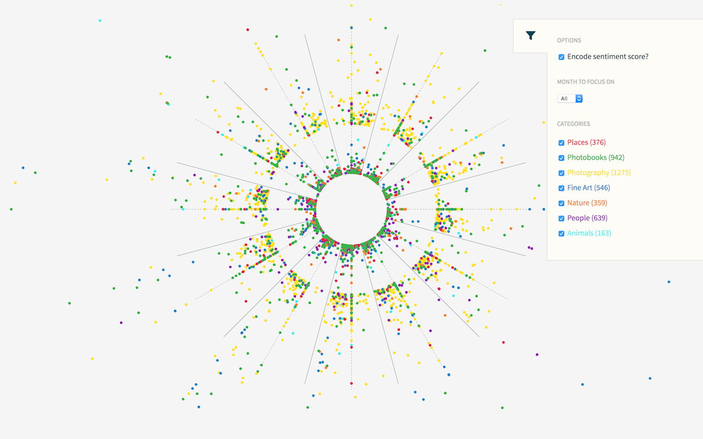

# Kickstarter Data Visualization

A web app to create information visualization for Kickstarter projects data. Data from [this web crawler](https://webrobots.io/kickstarter-datasets/ "webrockets.io") was optimized to a certain schema shown at the end. This is part of a group project at UMSI si649 w18 curriculum.

<a href="https://cdn.rawgit.com/navdeepsb/kickstarter-data-viz/master/" title="Kickstarter projects data visualization" target="_blank">Live demo of latest iteration</a><br />

Other demos:<br/>
<a href="https://rawgit.com/navdeepsb/kickstarter-data-viz/v3/sailorswheel.html" title="v3 - Kickstarter projects data visualization" target="_blank">v3</a><br />
<a href="https://rawgit.com/navdeepsb/kickstarter-data-viz/v2/sailorswheel.html" title="v2 - Kickstarter projects data visualization" target="_blank">v2</a><br />

_NOTE: These demos contain 2,000 projects extracted from a JSON stream containing projects till Jan 2018._




<br /><br />

#### Data encoding

- __% goal pledged__: radius (with a fixed offset)
- __Month of launch date__: angle (each sector will represent one month)
- __Sentiment score of blurb__: angle offset within a month sector


Each data point has two polar coordinates: `( r, A )`, where `r` is the radial distance from the center. In this case, the % goal pledged with zero starting on the circumference of the inner most circle). And `A` is the angle (starting in the first quadrant with positive clockwise rotation) making January occupy the 3 o'clock position and successive months falling on other clock positions. This angle also has an offset associated with it related to the sentiment score which ranges from -1 to +1 making the offset angle range from -15 to +15 degrees in a single month sector. So, within each sector, data points towards the left-side of the sector point to a sentiment score towards -1 and the right-side point to a +1.

<br /><br />


#### Datum schema
```json
{
    "id": 2016865793,
    "name": "Support the Strange and Unusual, from fantasy to conspiracy",
    "state": "failed",
    "category_name": "Digital Art",
    "category_id": 21,
    "location_state": "CO",
    "create_date": "2012-03-23",
    "launch_date": "2012-03-26",
    "state_change": "2012-05-07",
    "deadline_at": "2012-05-07",
    "location_id": 2391279,
    "goal": 5400,
    "pledged": 20,
    "perc_pledged": 0.37,
    "backers_count": 1,
    "launched_to_deadline_days": 42,
    "blurb": "Monsters, Fantasy, Illusion, Delusion, and a hint of reality. Check out an excellent way I found to express my digital paintings!",
    "score": 0.6114,
    "creator_id": 987604337,
    "slug": "represent-the-strange-and-unusual"
}
```


